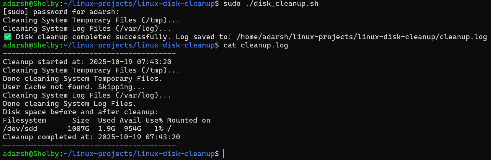

# 🧹 Linux Disk Cleanup Tool

### 👨‍💻 Author  
**Adarsh Shivan**<br>GitHub: [https://github.com/adarshshivan](https://github.com/adarshshivan)

---

## 📘 Overview
The **Linux Disk Cleanup** Tool is a Bash-based automation script that scans and removes unnecessary temporary, cache, and log files from the system.
It helps improve system performance, free up disk space, and maintain a clutter-free environment.
This project is safe, lightweight, and fully logged — ensuring that no critical files are touched.

---

## 🧰 Features
- Automatically detects and cleans system temporary files (/tmp)
- Clears cache directories and old log files (.log, .tmp, .cache)
- Empties Trash folder safely
- Logs every action performed to cleanup.log
- Displays disk usage summary before and after cleanup
- 100% safe — no important system files are deleted

---

## ⚙️ Tools & Technologies Used
- 🐧 Linux / WSL (Ubuntu)
- 💻 Bash Scripting
- 🧾 GitHub for version control
- ✍️ Nano / VS Code for editing scripts

---

## 🧩 How It Works
1. The script scans key directories: /tmp, $HOME/.cache, and /var/log.
3. It safely deletes unnecessary files such as .tmp, .log, .cache.
3. Cleans the user Trash folder if available.
4. Logs all actions with timestamps into cleanup.log.
5. Displays disk usage summary before and after cleanup.

---

## ▶️ Usage Instructions

### 1️⃣ Make It Executable
```bash
chmod +x disk_cleanup.sh
```

### 2️⃣ Run the Script (Safe and Logged)
```bash
sudo ./disk_cleanup.sh
```

or simply:

```bash
bash disk_cleanup.sh
```

---

### 📂 Example Output

### ▶️ After Running



---

### ⚡ Safe Practice

This project includes safe deletion logic — only temporary and cache-related files are targeted.
However, to practice without deleting real files, you can modify the script to use echo commands instead of delete commands:

Example safe version:
```bash
sudo find "$DIR" -type f -name "*.log" -o -name "*.tmp" -o -name "*.cache" -print
```

This will display what would be deleted — not actually delete it.

---

### 🎓 What I Learned

- How to safely automate file cleanup in Linux
- Writing modular and reusable Bash functions
- Handling logs and timestamps in Bash
- Building reliable automation tools for real-world tasks
- Documenting Linux automation scripts for portfolios

---

### 🧠 Project Summary

The Linux Disk Cleanup Tool is a practical Bash automation project that demonstrates safe system maintenance scripting.
It performs intelligent cleanup operations with detailed logging and verification steps, providing a balance between performance improvement and user safety.

This project demonstrates proficiency in:

Linux system file handling

Bash scripting and log management

System automation and safe deletion techniques

